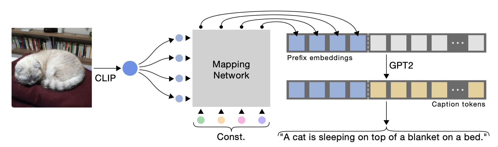

# Enhancing Long-Range Dependency Management: A Comprehensive Study on the Integration of Memorizing Transformers in ClipCap

- [Enhancing Long-Range Dependency Management: A Comprehensive Study on the Integration of Memorizing Transformers in ClipCap](#enhancing-long-range-dependency-management-a-comprehensive-study-on-the-integration-of-memorizing-transformers-in-clipcap)
  - [Introduction](#introduction)
    - [ClipCap Summary](#clipcap-summary)
    - [Main results](#main-results)
    - [Additional Results](#additional-results)
    - [Ablation Studies](#ablation-studies)
    - [Related Work](#related-work)
  - [Exploring ClipCap's Capabilities: Potential and Challenges](#exploring-clipcaps-capabilities-potential-and-challenges)
    - [Strengths](#strengths)
    - [Weaknesses](#weaknesses)
  - [Our contribution: Utilizing Memorizing Transformers for Improved Long-Range Dependency Handling](#our-contribution-utilizing-memorizing-transformers-for-improved-long-range-dependency-handling)
  - [Datasets](#datasets)
    - [Pre-processing](#pre-processing)
  - [Results](#results)
  - [Conclusion](#conclusion)
  - [References](#references)
  - [Contributions](#contributions)

## Introduction
<!-- Introduction: An analysis of the paper and its key components. Think about it as a nicely formatted review as you would see on OpenReview.net. It should contain one paragraph of related work as well. -->
__Image captioning__ is a multimodal task that involves generating textual descriptions of images. This research investigates a method called [ClipCap](https://arxiv.org/abs/2111.09734), which was explicitly proposed for this task, and explores the potential of enhancing this method by integrating long-range dependency handling into the model.

### ClipCap Summary

*Overview of the ClipCap architecture ([1](https://arxiv.org/abs/2111.09734)).*

The ClipCap method utilizes a pipeline of pre-trained models to generate captions for images. This pipeline consists of the [CLIP](https://arxiv.org/abs/2103.00020) model, a mapping network, and a pre-trained language model (LM), namely [GPT-2](https://d4mucfpksywv.cloudfront.net/better-language-models/language-models.pdf). The CLIP image encoder extracts high-level information from the visual data while the pre-trained LM generates the caption. The mapping network serves as a bridge between the two, linking the latent spaces of the two models.

More specifically, for a given image, the CLIP image encoder generates an embedding containing high-level information about the image. This embedding is passed through the mapping network to obtain a so-called "prefix", a list of embeddings associated with the image content. Finally, the prefix embeddings are used as input to GPT-2, which will generate the output caption autoregressively.

### Main results
The authors experiment with two different training procedures for the ClipCap model pipeline. In the first approach, the CLIP model is kept static, GPT-2 is fine-tuned, and the mapping network is an MLP that is trained from scratch. In the second approach, the CLIP and GPT-2 models are both kept static, and the mapping network is a [Transformer](https://arxiv.org/abs/1706.03762) encoder that is trained from scratch. The authors found that the first approach often yielded better results but required more training time.

Both approaches were evaluated on the [Conceptual Captions](https://aclanthology.org/P18-1238.pdf), [NoCaps](https://arxiv.org/abs/1812.08658), and [COCO](https://arxiv.org/abs/1405.0312) datasets, achieving state-of-the-art performance while requiring significantly less training time and data than previous methods. Additionally, the ClipCap architecture is more straightforward and faster than earlier methods.

### Additional Results
Multiple other experiments were conducted to determine when ClipCap performs well and when not. For example, the authors found that fine-tuning the LM results in a much more expressive model but that this model is more susceptible to overfitting. Additionally, an interpretability study was conducted to further understand the model's inner workings, in which the prefix embeddings are interpreted as a sequence of tokens. It was found that the interpretation is meaningful when both the mapping network and the LM are trained but that it becomes essentially unreadable when only the mapping network is trained. The authors hypothesize that this happens because the network is also charged with maneuvering the fixed LM.

### Ablation Studies
The authors conducted multiple ablation studies to verify and motivate ClipCap's design choices. They found that the mapping network is crucial for the model to perform well and that a Transformer architecture is superior when the LM is frozen, while an MLP is more effective when the LM is additionally fine-tuned. Furthermore, the prefix length was a crucial hyperparameter; a prefix that is too short results in a lack of expressiveness, while a prefix that is too long results in a very large model that will be slow to train.

### Related Work
Previous research has delved into both image-based and video-based recognition tasks. Progress in Long Short-Term Memory networks (LSTMs) ([9](https://ieeexplore.ieee.org/abstract/document/7984828?casa_token=tmveUf25t1YAAAAA:lA57sykKCMVgMyWyhWtJLkrd-6zCYp5IoEpaBG0LakMX6YBSM85iausLxGG9UVO0sJI-_RW5)), spatio-temporal feature learning for 3D convolutional networks ([7](https://ieeexplore.ieee.org/document/7410867), [6](https://arxiv.org/abs/1510.00562)), and long-term recurrent convolutional networks ([8](https://arxiv.org/abs/1510.00562)) have produced models capable of generating captions for both images and videos. However, these models demand significant computational resources and extensive data. Alternative methods leverage vision and language pre-training with the BERT architecture ([10](https://arxiv.org/pdf/2111.09734.pdf), [11](https://aclanthology.org/N19-1423/), [12](https://arxiv.org/abs/2101.00529), [13](https://ojs.aaai.org/index.php/AAAI/article/view/7005), [14](https://arxiv.org/abs/2108.10904)). Nonetheless, these methods are either limited to specific datasets ([10](https://arxiv.org/pdf/2111.09734.pdf), [12](https://arxiv.org/abs/2101.00529), [13](https://ojs.aaai.org/index.php/AAAI/article/view/7005)), which leads to compromised generalizability, or they involve a pre-training process that is computationally intensive ([14](https://arxiv.org/abs/2108.10904)). Hence, the authors advocate for the ClipCap model primarily for its efficiency and relative simplicity.

## Exploring ClipCap's Capabilities: Potential and Challenges
<!-- Exposition of its weaknesses/strengths/potential which triggered your group to come up with a response. -->

### Strengths
One of the key strengths of ClipCap model is its use of pre-trained models. This allows the model to be trained on a small amount of data, which is a significant advantage over other methods that require large amounts of data to achieve state-of-the-art performance. It also ensures that training time remains low, since the number of trainable parameters stays constant when training only the mapping network.

Moreover, the ClipCap pipeline is modular, allowing for the swift adaptation or replacement of the image encoder, mapping network and/or LM component(s). This makes the model future-proof, as a more powerful image encoder or LM can be easily integrated into the pipeline. However, the authors did not explore the potential of using other pre-trained models. It would be useful to review this aspect in the form of an ablation study to understand the pipeline's strengths and weaknesses better.

Other than a dataset of image-text pairs, the model does not require any additional annotations. Additionally, the method is easy to understand and implement, and the authors provide a reference implementation that worked out-of-the-box.

### Weaknesses
Apart from images, other visual data such as video segments naturally have long-range dependencies between individual frames. When interpreted seperately, each frame may not contain enough information to generate a meaningful caption for the whole video. However, when interpreted jointly, emergent patterns may be observed that can be used to generate a more accurate caption. The ClipCap model does not account for these long-range dependencies as the mapping network's Transformer only has a limited context window, and therefore may not be able to generate accurate captions considering entire videos.

## Our contribution: Utilizing Memorizing Transformers for Improved Long-Range Dependency Handling
<!-- Describe your novel contribution. -->
Our research investigates potential performance enhancements in video captioning by integrating a [Memorizing Transformer](https://arxiv.org/abs/2203.08913) into ClipCap's mapping network.

The Memorizing Transformer extends the original [Transformer](https://arxiv.org/abs/1706.03762) architecture to memorize internal representations of past inputs, aiming to improve the performance of language modeling tasks. The system utilizes an approximate kNN lookup to recall the most recent key-value pairs. This strategy enables the _kNN-memory_ model to harness learned information from previously encountered data for current predictions, thereby accounting for long-range dependencies. The original paper applies this concept to language models, effectively addressing the issue of long-term dependencies. We hypothesize that this approach can be extended to visual information for the task of video captioning, where long-range dependencies are also prevalent.

## Datasets
In line with the methodology of ClipCap, we will use the COCO dataset for the initial pretraining stage of our mapping network. This allows the model to learn a general understanding of the relationship between images and text.

Following the pretraining, we will employ the [ActivityNet Captions](https://arxiv.org/pdf/1705.00754v1.pdf) dataset for fine-tuning. The ActivityNet Captions dataset provides a more task-specific data source explicitly designed for captioning temporally spread-out activities in videos. It contains 20k videos with 100k detailed descriptions of sequences of events within them, making it an optimal choice for our research.

### Pre-processing
Videos are converted into image frames at a rate of 5 frames per second (fps). Since our focus is solely on captioning and not temporal action localization, we extract all frames from the start to the end of each captioned segment, treating each as an independent _video clip_. The frames are individually embedded using the CLIP image encoder, and the captions are tokenized using the GPT-2 tokenizer. Given that we are only finetuning the model, we will use a small subset of ActivityNet Captions. The final pre-processed datasets can be downloaded with the links provided in our [GitHub repository](https://github.com/SebastiaanJohn/knn-memory-clipcap). Some statistics of the dataset splits we used for training and testing are shown below.

|             | __Train__ | __Test__ |
|-------------|-----------|----------|
| Videos      | 300       | 100      |
| Video clips | 1112      | 371      |
| Frames      | 198020    | 69731    |
| Length (hours) | 275    | 97       |

## Results
<!-- Results of your work (link that part with the code in the jupyter notebook) -->

## Conclusion

## References
1. Agrawal, H. et al. (2019). “Nocaps: Novel object captioning at scale”. In: Proceedings of the IEEE/CVF international conference on computer vision (pp. 8948–8957).
2. Caba Heilbron, F. et al. (2015). “Activitynet: A large-scale video benchmark for human activity understanding”. In: Proceedings of the ieee conference on computer vision and pattern recognition (pp. 961–970).
3. Lin, T et al. (2014). “Microsoft coco: Common objects in context”. In: Computer Vision–ECCV 2014: 13th European Conference, Zurich, Switzerland, September 6-12, 2014 (pp. 740–755).
4. Sharma, P. et al. (2018). “Conceptual captions: A cleaned, hypernymed, image alt-text dataset for automatic image captioning”. In: Proceedings of the 56th Annual Meeting of the Association for Computational Linguistics (pp. 2556–2565).
5. Wu, Y. et al. (2022). “Memorizing Transformers”. In: International Conference on Learning Representations.
6. Sun, L. et al. (2015). "Human action recognition using factorized spatio-temporal convolutional networks". In: Proceedings of the IEEE international conference on computer vision (pp. 4597-4605).
7. Tran, D. et al. (2015). "Learning Spatiotemporal Features with 3D Convolutional Networks". In: Proceedings of the IEEE international conference on computer vision (pp. 4489-4497).
8. Donahue, J.et al. (2015). "Long-term recurrent convolutional networks for visual recognition and description". In: Proceedings of the IEEE conference on computer vision and pattern recognition (pp. 2625-2634).
9. Gao, L. et al. (2017). "Video Captioning With Attention-Based LSTM and Semantic Consistency". In: IEEE Transactions on Multimedia (pp. 2045-2055).
10. Li, X. et al. (2020). "Oscar: Object-semantics aligned pre-training for vision-language tasks". In: European Conference on Computer Vision (pp. 121–137).
11. Devlin, J., Chang, M., Lee, K. and Toutanova, K. (2018). "BERT: Pre-training of Deep Bidirectional Transformers for Language Understanding". 
12. Pengchuan Zhang et al. (2021). "VinVL: Revisiting visual representations in vision-language models". In: Proceedings of the IEEE/CVF Conference on Computer Vision and Pattern Recognition (pp. 5579–5588).
13. Zhou, L. et al. (2020). "Unified vision-language pretraining for image captioning and VQA". In: Proceedings of the AAAI Conference on Artificial Intelligence (pp. 13041–13049).
14. Wang, Z. (2021). "SimVLM: Simple Visual Language Model Pretraining with Weak Supervision".

## Contributions
<!-- Close the notebook with a description of each student's contribution. -->
